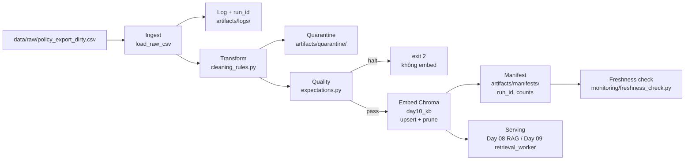

# Kiến trúc pipeline — Lab Day 10

**Nhóm:** Khoa  
**Cập nhật:** 2026-06-10

---

## 1. Sơ đồ luồng

**Điểm quan sát chính:**

| Điểm | Vị trí | Artifact |
|------|--------|----------|
| `run_id` | Đầu mỗi run | `artifacts/logs/run_<id>.log`, `manifest_<id>.json` |
| Quarantine | Sau clean, trước validate | `artifacts/quarantine/quarantine_<id>.csv` |
| Freshness | Sau manifest | Log dòng `freshness_check=PASS/WARN/FAIL` |
| Publish boundary | Sau embed upsert | Metadata chunk có `run_id` |

---

## 2. Ranh giới trách nhiệm

| Thành phần | Input | Output | Owner nhóm |
|------------|-------|--------|------------|
| Ingest | `data/raw/*.csv` | `raw_records`, log | Khoa (Ingestion) |
| Transform | raw rows | `cleaned_*.csv`, `quarantine_*.csv` | Khoa (Cleaning) |
| Quality | cleaned rows | pass/halt, expectation log | Khoa (Cleaning) |
| Embed | cleaned CSV | Chroma `day10_kb`, `embed_upsert` log | Khoa (Embed) |
| Monitor | manifest JSON | freshness PASS/WARN/FAIL | Khoa (Monitoring) |

---

## 3. Idempotency & rerun

- **Chiến lược:** `col.upsert(ids=chunk_id, ...)` — rerun cùng cleaned không tạo duplicate id.
- **Prune:** xóa vector id có trong collection nhưng không còn trong cleaned run hiện tại (`embed_prune_removed` trong log khi có id thừa).
- **Chứng cứ:** `run_id=sprint2-rerun1` và `sprint2-rerun2` đều `embed_upsert count=6`, collection không phình.
- **Sau inject:** chạy lại pipeline chuẩn (`after-fix`) để prune chunk stale refund khỏi index.

---

## 4. Liên hệ Day 09

- **Corpus gốc:** `data/docs/` (policy, SLA, FAQ, HR) — cùng narrative Day 08/09.
- **Khác biệt Day 10:** ingest qua **export CSV** (`policy_export_dirty.csv`) mô phỏng batch DB, không đọc file `.txt` trực tiếp khi chạy pipeline.
- **Vector store:** collection `day10_kb` (`.env` `CHROMA_COLLECTION`) — tách khỏi index Day 09 để thử pipeline an toàn.
- **Tích hợp:** Day 09 `retrieval_worker` trỏ `CHROMA_COLLECTION=day10_kb` + cùng `EMBEDDING_MODEL=all-MiniLM-L6-v2` sau khi Day 10 publish manifest `after-fix`.

---

## 5. Rủi ro đã biết

- **Bypass validate:** `--skip-validate` chỉ dùng demo Sprint 3; production phải halt trước embed.
- **Freshness snapshot cũ:** `exported_at` trong CSV mẫu có thể FAIL SLA 24h; lab dùng `FRESHNESS_SLA_HOURS=2000` để demo PASS — production cần re-ingest.
- **Rule chưa kích hoạt trên mẫu:** `chunk_too_short`, `future_effective_date` chỉ tác động khi inject thêm dòng lỗi vào raw.
- **Log không commit:** `*.log` gitignore — dùng manifest JSON làm nguồn số liệu chính thức khi nộp bài.
